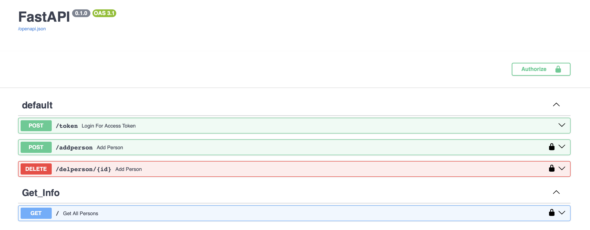

# FASTAPI CRUD with Authentication and RBAC


## Overview
This repository is a beginner-friendly exercise designed to help you dive into the world of APIs using **FastAPI**. It showcases the implementation of a basic CRUD API with added authentication and Role-Based Access Control (RBAC).

The API allows you to:
- Add users (admin role only).
- Delete users.
- Get a list of all users.

While the update method is not implemented, it can be added with ease. This project is perfect for anyone new to FastAPI and looking to learn about building secure and robust APIs.

## Features
- **CRUD Operations**: Basic Create, Read, and Delete functionality.
- **Authentication**: Implements OAuth2.0 with JWT tokens for secure access.
- **Role-Based Access Control (RBAC)**:
  - Two roles: `admin` and `user`.
  - Only `admin` can add users.
- **Database**:
  - Uses **SQLite** as the default database.
  - Can be easily replaced with MySQL or PostgreSQL.
- **SQLAlchemy ORM**: For database interactions.

## Prerequisites
- Python 3.10+
- Basic understanding of Python

## Installation
1. Clone the repository:
   ```bash
   git clone https://github.com/MaazK7/fastapi-crud-api.git
   cd fastapi-crud-api
   ```

2. Create and activate a virtual environment:
   ```bash
   python -m venv venv
   source venv/bin/activate   # On Windows, use `venv\Scripts\activate`
   ```

3. Install the dependencies:
   ```bash
   pip install -r requirements.txt
   ```

## Running the Application
1. Start the FastAPI server:
   ```bash
   uvicorn main:app --reload
   ```

2. Access the API documentation:
   - Open [http://127.0.0.1:8000/docs](http://127.0.0.1:8000/docs) for the interactive Swagger UI.
   - Alternatively, visit [http://127.0.0.1:8000/redoc](http://127.0.0.1:8000/redoc).

## API Endpoints
### Public Endpoints
- **Login**
  - `POST /token`
  - Authenticate and obtain a JWT token.

### Protected Endpoints (Require Authentication)
- **Get All Users**
  - `GET /users`
  - Accessible to both `admin` and `user` roles.

- **Add User**
  - `POST /users`
  - Accessible to `admin` role only.

- **Delete User**
  - `DELETE /users/{user_id}`
  - Accessible to both `admin` and `user` roles.





## Learning Outcomes
By working through this project, you will:
- Understand the basics of building APIs with FastAPI.
- Learn how to secure APIs with OAuth2.0 and JWT.
- Get hands-on experience with Role-Based Access Control (RBAC).
- Work with SQLAlchemy ORM and SQLite database.


## Contribution
Contributions are welcome! Feel free to fork this repository and submit a pull request with your improvements or fixes.

## License
This project is open-source and available under the MIT License. See the `LICENSE` file for more details.


